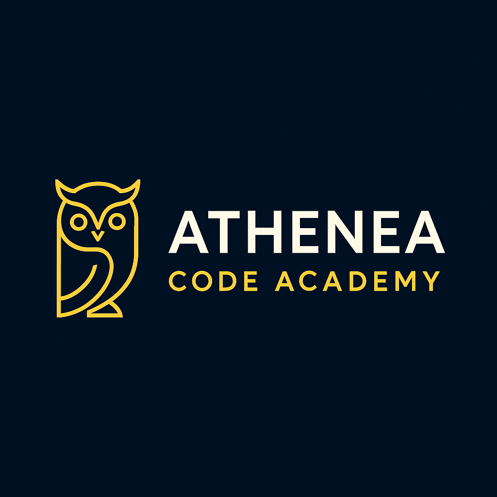

# 🏛️ Athenea Code Academy - Curso de Python

## 🎯 Nuestra Misión

En **Athenea Code Academy** creemos que la programación **no es solo para programadores e ingenieros**. Queremos romper esa barrera y llevar el poder de la automatización y la programación a **personas de cualquier perfil profesional**, sin importar si nunca antes han tocado una línea de código.

Nuestro curso de **Python** está diseñado para que aprendas desde cero, de forma clara, práctica y amena. Queremos que seas capaz de **automatizar tareas repetitivas**, **resolver problemas cotidianos** y, en definitiva, **facilitar tu vida laboral y personal** usando herramientas tecnológicas modernas y accesibles.

---

## 🐍 ¿Por qué Python?

Python es un lenguaje de programación:

- **Fácil de aprender** gracias a su sintaxis sencilla y clara.
- **Versátil**, usado en muchas áreas: automatización, análisis de datos, web, inteligencia artificial y más.
- **Potente**, con una gran comunidad y bibliotecas para todo tipo de tareas.
- **Ideal para principiantes**, por eso es nuestro lenguaje elegido para el curso.

---

## 📚 Qué aprenderás en este curso

- Conceptos básicos de programación: variables, tipos de datos, funciones, condicionales y bucles.
- Cómo escribir y ejecutar scripts de Python para automatizar tareas.
- Uso de librerías populares para procesar datos y generar visualizaciones e informes.
- Introducción a herramientas como Jupyter Notebook para explorar e investigar.
- Buenas prácticas para organizar tu código y hacerlo fácil de mantener.
- Ejercicios y proyectos prácticos que puedes aplicar en tu trabajo o vida diaria.

---

## 🚀 ¿A quién está dirigido?

Este curso está pensado para:

- Personas curiosas que quieren iniciarse en la programación sin miedo.
- Profesionales que quieren automatizar tareas repetitivas en su trabajo.
- Emprendedores que desean aprovechar la tecnología para mejorar procesos.
- Cualquier persona sin experiencia previa en programación que busque aprender Python de manera práctica y aplicada.

---

## 🔧 Metodología y recursos

- **Clases 100% online**, en vivo y grabadas, para que aprendas a tu ritmo.  
- Material didáctico actualizado y enfocado en la práctica real.  
- Ejemplos paso a paso, con explicaciones claras y accesibles.  
- Soporte continuo en comunidad y sesiones de dudas en vivo.  
- Proyectos reales para que consolides tus conocimientos con ejercicios prácticos.  

---

## 🎓 Resultados que obtendrás

- Capacidad para crear tus propios scripts y automatizar tareas cotidianas.
- Entenderás cómo funciona la programación y la lógica detrás de ella.
- Confianza para seguir aprendiendo y avanzar en áreas más avanzadas de la tecnología.
- Una base sólida para aplicar Python en distintos entornos profesionales.

---

<!--
## 💬 Testimonios de nuestros estudiantes

> “Nunca pensé que podría aprender a programar, pero con Athenea Code Academy entendí todo desde cero y ahora automatizo muchas tareas que antes me tomaban horas.”  
> — *María G., asistente administrativa*

> “Las clases son claras y prácticas, el enfoque para no programadores realmente funciona. Ya he creado varios scripts para facilitar mi trabajo.”  
> — *Carlos T., gerente de proyectos*
-->

---

## 📞 Contacto

¿Quieres más información o inscribirte? Escríbenos:  
📧 contacto@athenecodeacademy.com  
🌐 [www.athenecodeacademy.com](https://www.athenecodeacademy.com)  

Síguenos en redes para no perderte novedades:  
- Twitter: [@AtheneaCode](https://twitter.com/AtheneaCode)  
- LinkedIn: [Athenea Code Academy](https://linkedin.com/company/athenecodeacademy)  

---

## ⚖️ Licencia

Este repositorio y todos los materiales del curso están bajo licencia MIT. Puedes usarlos, compartirlos y adaptarlos para tu aprendizaje y proyectos personales.

---

## 🙌 ¡Únete a Athenea Code Academy!

Aprender Python nunca fue tan sencillo y útil. Da el primer paso para transformar tu día a día con tecnología.  
**¡Te esperamos!**

---

